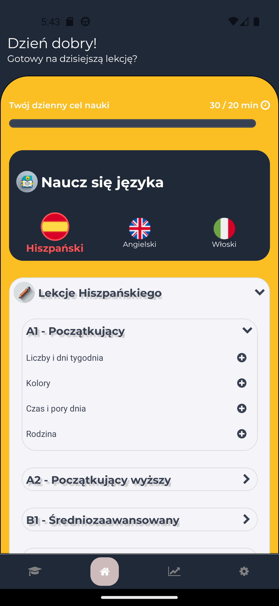
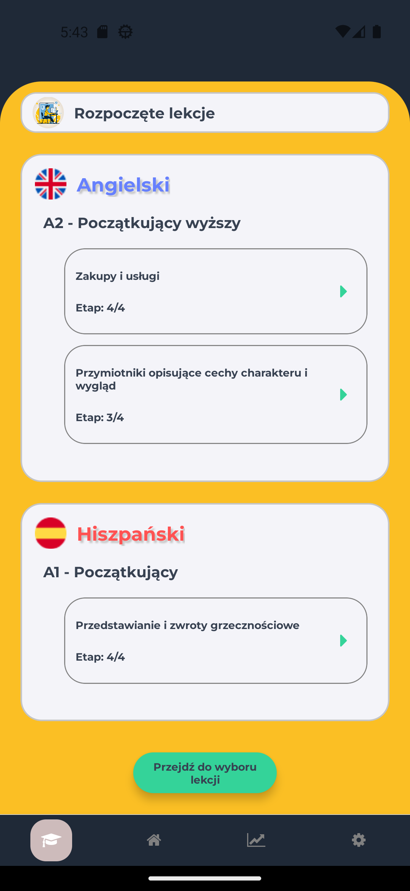
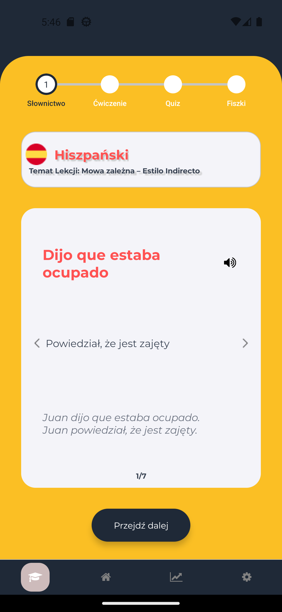
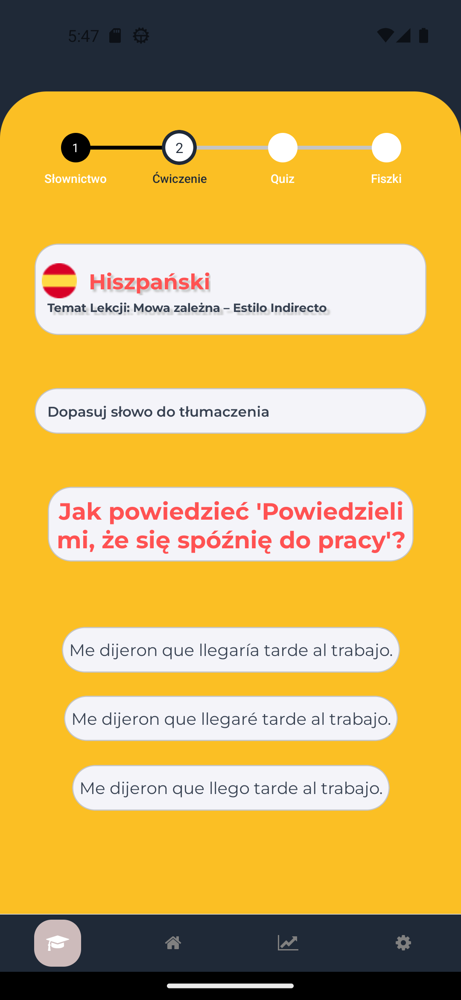
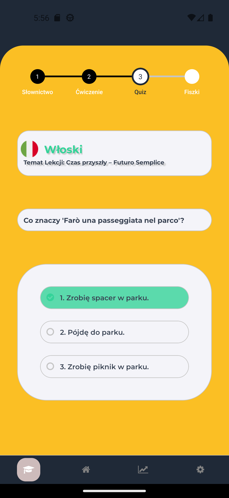
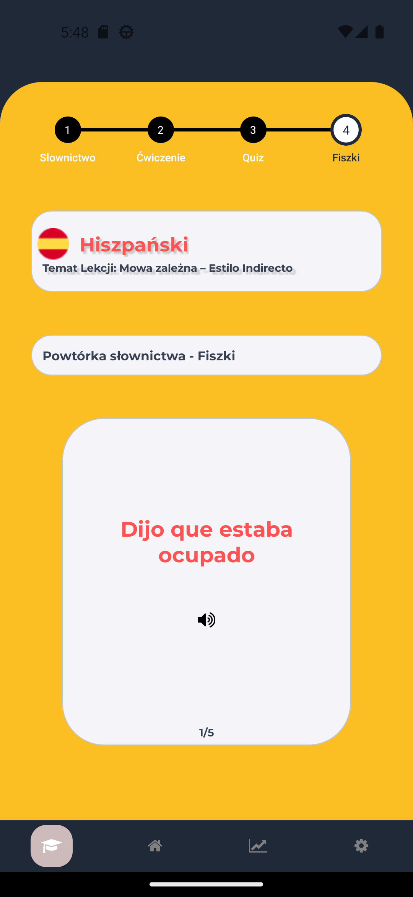
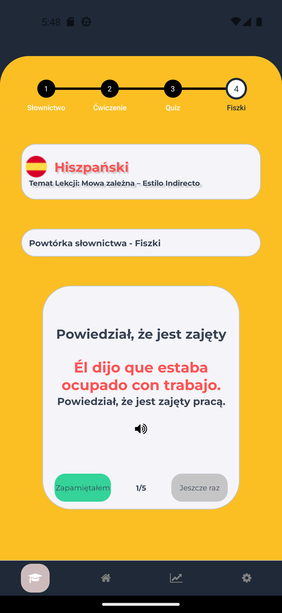
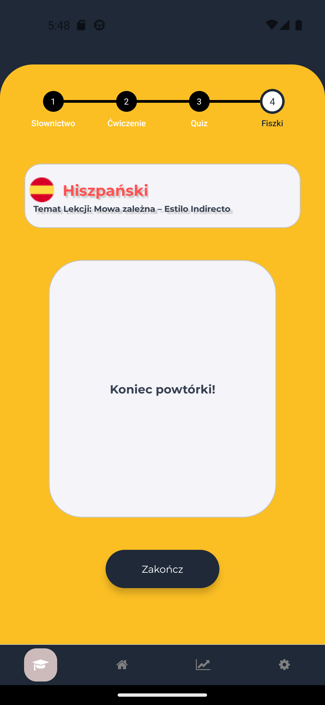
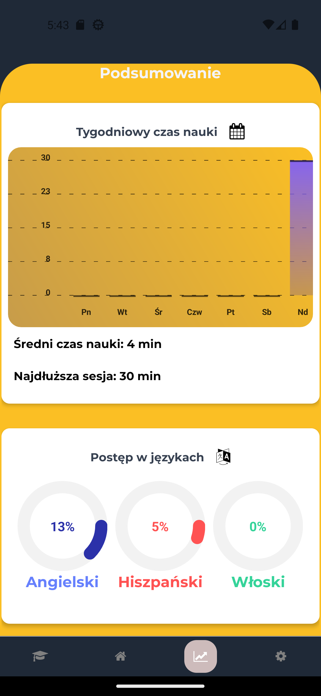

# 📱 Aplikacja Mikrolearningowa do Nauki Języków #

## 📌 Opis projektu ##

Aplikacja mobilna wspierająca naukę języków obcych, oparta na metodzie mikrolearningu. Użytkownik może uczyć się poprzez interaktywne lekcje składające się z czterech etapów:

- ✅ Słownictwo – poznawanie nowych słów i wyrażeń
- ✅ Ćwiczenie – interaktywne zadania sprawdzające wiedzę
- ✅ Quiz – testowanie zapamiętanych informacji
- ✅ Fiszki – powtarzanie i utrwalanie materiału

### Aplikacja oferuje także: ###

🔒 Rejestrację i logowanie (e-mail oraz Google)

🔔 Powiadomienia przypominające o nauce

📊 Śledzenie postępów użytkownika

# 🛠️ Technologie #

Projekt został zbudowany z wykorzystaniem:

- React Native + Expo

- Firebase Authentication – obsługa logowania

- Firestore Database – przechowywanie danych

- Expo Notifications – powiadomienia o nauce

# 📷 Podgląd aplikacji #

| Ekran logowania | Ekran rejestracji | Ekran główny |
|---|---|---|
|  |  |  |

| Rozpoczęte lekcje | Lekcja / Słownictwo | Lekcja / Ćwiczenie |
|---|---|---|
|  |  |  |

| Lekcja / Quiz | Lekcja / Przód Fiszki | Lekcja / Tył Fiszki |
|---|---|---|
|  |  |  |

| Koniec lekcji | Statystyki | Ustawienia |
|---|---|---|
|  |  |  |

# 🔧 Przyszłe usprawnienia #

- 🎤 Ćwiczenie wymowy – możliwość nagrywania i analizy poprawności wymowy
- 📊 Zaawansowane statystyki – szczegółowa analiza postępów użytkownika
- 🌍 Rozszerzenie bazy materiałów – więcej języków i ćwiczeń
